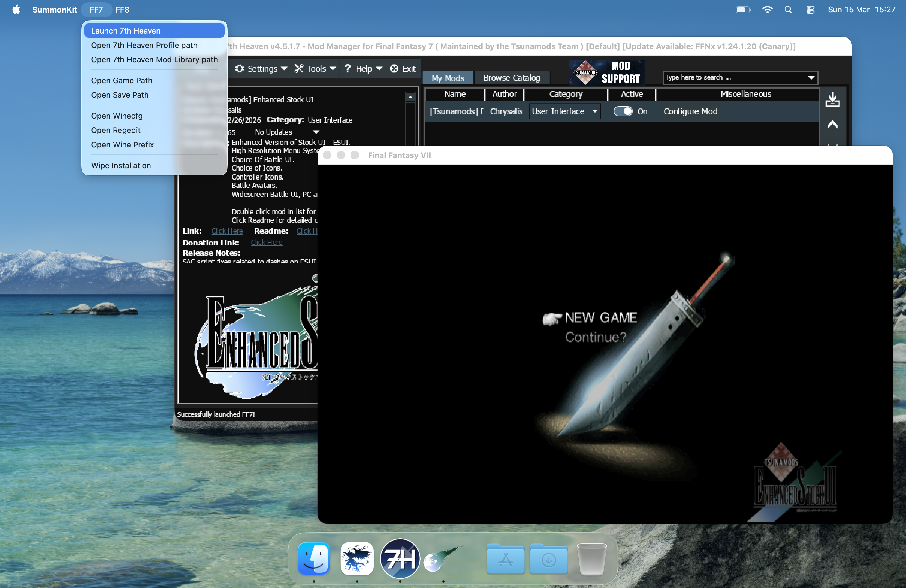

    

<div align="center">
  
</div>

# SummonKit

macOS wrapper for Final Fantasy Mod managers

## Features

Mod Managers supported:

- [7thHeaven](https://github.com/tsunamods-codes/7th-Heaven)
- [Junction VIII](https://github.com/tsunamods-codes/Junction-VIII)

Game editions supported:

- [FINAL FANTASY VII (2013)](https://steamdb.info/app/39140/) (Steam)
- [FINAL FANTASY VII](https://steamdb.info/app/3837340/) (Steam)
- [FINAL FANTASY VII](https://www.gog.com/en/game/final_fantasy_vii) (GOG)
- [FINAL FANTASY VIII](https://steamdb.info/app/39150/) (Steam)

## FAQ

### Does SummonKit support Steam achievements?

**NO!** Steam achievements are not yet supported, until Valve will allow us to make use of Steam IPC. That layer has been implemented in Proton, however is not available for macOS.

### Which is the best Backend renderer?

The suggested one to be used is **Vulkan**. This is currently the automatic chosen option when using default settings.

DirectX 11/12 is also possible to be used, via [DXMT](https://github.com/3Shain/dxmt) however the performance is not at the same level as Vulkan. Feel free to experiment with it.

OpenGL under Apple Silicon simply does NOT work. While on Intel Macs it may. Do not consider using this option as it is mainly provided for legacy reasons, which does not apply for Mac machines.

## How to use

First of all, download the [latest release](https://github.com/julianxhokaxhiu/SummonKit/releases/latest) and install the `SummonKit.app` in your `Applications` folder.

Then, depending on which game edition you own you might want to follow one of the following sections.

**PLEASE NOTE:** This app has NOT been notarized, so you will need to manually allow the app to run. [See How to open an app that hasn’t been notarized or is from an unidentified developer](https://support.apple.com/en-us/102445)

## 7th Heaven



### GOG Release

- Download the installer files from the [GOG release](https://www.gog.com/en/game/final_fantasy_vii)
- Launch `SummonKit.app` and click on `FF7 -> Launch 7th Heaven`
- Follow the prompts ( accept permission requests if any )
- When asked to pick an installer pick the `setup_final_fantasy_vii_2.0_gog_v1_(88522).exe` file
- Accept the EULA and click on Install
- Click on Exit when the installer finishes
- When 7th Heaven launches, hit Save on the Settings window and wait for FFNx to be installed
- Hit Play and Enjoy!

### Steam 2013 or Rerelease

- Install [Steam for Mac](https://cdn.fastly.steamstatic.com/client/installer/steam.dmg)
- Quit the Steam app
- Run this in your terminal: `echo "@sSteamCmdForcePlatformType windows" > ~/Library/Application Support/Steam/Steam.AppBundle/Steam/Contents/MacOS/steam_dev.cfg`
- Open Steam and install [FINAL FANTASY VII (2013)](https://steamdb.info/app/39140/) or [FINAL FANTASY VII](https://steamdb.info/app/3837340/)
- Launch `SummonKit.app` and click on `FF7 -> Launch 7th Heaven`
- Follow the prompts ( accept permission requests if any )
- When asked to pick an installed click on Skip
- When 7th Heaven launches, hit `Save` on the Settings window and wait for FFNx to be installed
- Hit Play and Enjoy!

## Junction VIII


### Steam 2013

- Install [Steam for Mac](https://cdn.fastly.steamstatic.com/client/installer/steam.dmg)
- Quit the Steam app
- Run this in your terminal: `echo "@sSteamCmdForcePlatformType windows" > ~/Library/Application Support/Steam/Steam.AppBundle/Steam/Contents/MacOS/steam_dev.cfg`
- Open Steam and install [FINAL FANTASY VIII](https://steamdb.info/app/39150/)
- Launch `SummonKit.app` and click on `FF8 -> Launch Junction VIII`
- Follow the prompts ( accept permission requests if any )
- When Junction VIII launches, hit `Save` on the Settings window and wait for FFNx to be installed
- Hit Play and Enjoy!

## How to build

Make sure you have installed the [XCode Command Line Tools](https://developer.apple.com/documentation/xcode/installing-the-command-line-tools#Install-the-Command-Line-Tools-package-in-Terminal), then:

```sh
$ git clone https://github.com/julianxhokaxhiu/SummonKit.git
$ cd SummonKit
$ ./build.sh
```

The final result will be in the `dist/` folder.

## Credits

This wrapper is possible thanks to:

- [Dean M Greer](https://github.com/Gcenx) for [Winehq macOS Builds](https://github.com/Gcenx/macOS_Wine_builds)
- [Feifan He](https://github.com/3Shain) for [DXMT](https://github.com/3Shain/dxmt)

## License

SummonKit is released under GPLv3 license. You can get a copy of the license here: [COPYING.TXT](COPYING.TXT)

If you paid for SummonKit, remember to ask for a refund from the person who sold you a copy. Also make sure you get a copy of the source code (if it was provided as binary only).

If the person who gave you this copy refuses to give you the source code, report it here: https://www.gnu.org/licenses/gpl-violation.html

All rights belong to their respective owners.
